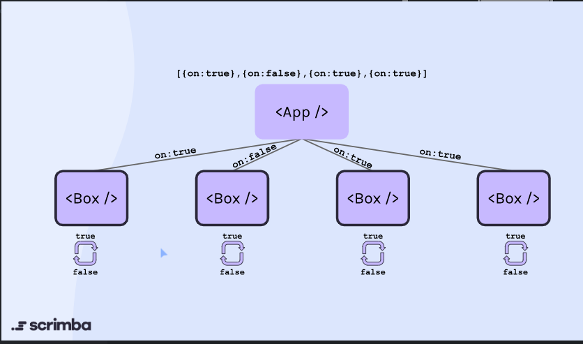

To change the states in components either we can change the state in each child component called derived state (Not mostly used)  
[Derived State](https://reactjs.org/blog/2018/06/07/you-probably-dont-need-derived-state.html)

In this method when the state was being changed in boxes only the local state in each component was being changed whereas the original state of the App component was not being changed and there exists two sources of truths in such case.

Another method is to have state only in App and create a function called Toggle and pass it to other child components and when child is clicked toggle is triggered to update the app. 

Toggle function example 
    const toggle = id => setSquares(
                        prevSquares=>prevSquares.map(square=>square.id === id ? {...square,on: !square.on}:square)  
                        );

// function toggle(id) {
//     setSquares(prevSquares => {
//         return prevSquares.map((square) => {
//             return square.id === id ? {...square, on: !square.on} : square
//         })
//     })
// }

Alternative to passing id is to pass the id in toggle function instead of passing id to the prop.

const squareElements = squares.map(square => (
    <Box 
        key={square.id} 
        id={square.id}
        on={square.on} 
        toggle={toggle}
    />
))

or

const squareElements = squares.map(square => (
    <Box 
        key={square.id} 
        on={square.on} 
        toggle={() => toggle(square.id)}
    />
))